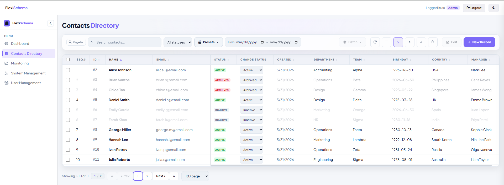
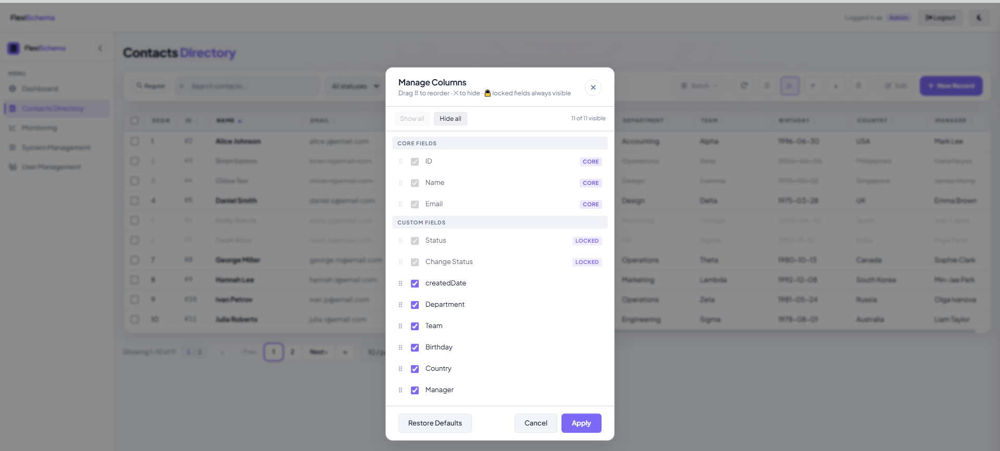
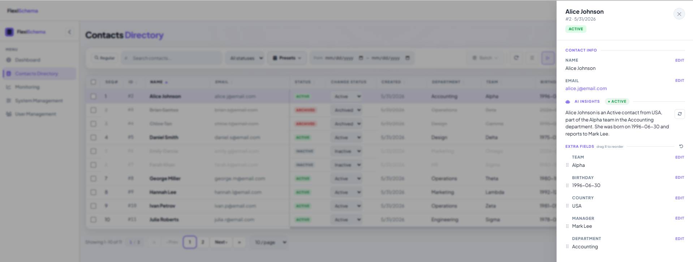
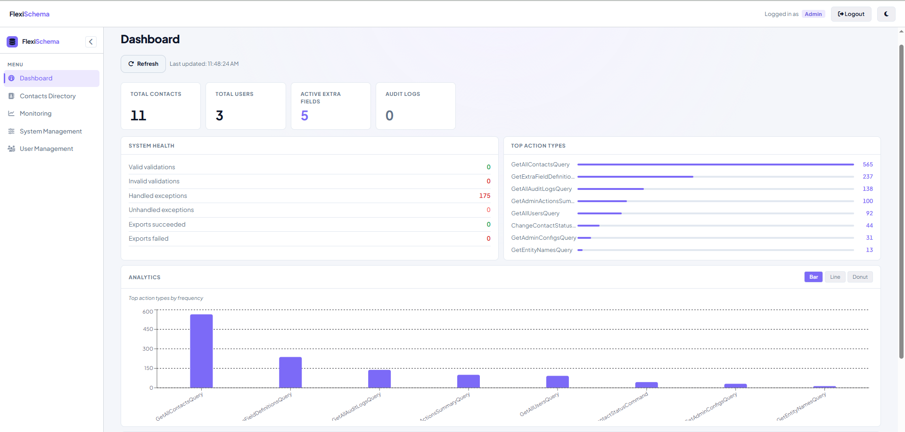

# Flexi Schema CRM

A modern, highly-performant Contact Management and CRM application built with React, TypeScript, and Vite. This application demonstrates scalable frontend architecture, robust state management, AI-powered features, and optimized rendering techniques suitable for enterprise environments.



## ✨ Key Features

- **High-Performance Table Virtualization:** Utilizes `@tanstack/react-virtual` to render thousands of contact rows seamlessly without freezing the DOM.
- **Dynamic & Resizable Columns:** Users can drag-and-drop to reorder columns using `@hello-pangea/dnd` and dynamically resize column widths.
- **Role-Based Access Control (RBAC):** Secure routing and UI elements conditionally rendered based on user roles (`Admin`, `Editor`, `Viewer`).
- **Dynamic Schema System:** Administrators can define custom "Extra Fields" for contacts, which instantly propagate to the UI, data tables, and forms.
- **AI-Powered Features (Groq + LLaMA 3.1 8B):**
  - **AI Search Bar**: Toggle between "Regular" and "AI" search modes. In AI mode, type natural language queries like *"contacts added last week"* or *"manager is Marco"* and the backend's Groq AI parses them into structured filters. Includes recent search history, example prompt pills, result counts, and graceful fallback to standard search.
  - **Contact Insights**: Open any contact's drawer to see an AI-generated 2-sentence profile summary and relationship tag (Lead / Active / At Risk). Results are cached server-side; a regenerate button is available for fresh analysis.
  - **Smart CSV Import Mapper**: When importing CSV files, the "Auto-Map with AI" button sends headers and sample data to the backend, which uses AI to infer column mappings to system fields. The AI suggestions pre-fill the dropdown selections; you can review and adjust every mapping before importing.
- **Import & Export Tools**: Full CSV/Excel import with preview, column selection for export, and print support.
- **Admin Dashboard**: Analytics, metrics, audit logs, user management, and dynamic field schema administration.
- **Feature-Based Architecture:** Code is modularized into business domains (Auth, Contacts, Admin) for maximum scalability.
- **Comprehensive Testing:** Automated unit and integration testing suite powered by Vitest and React Testing Library.

## 🛠 Tech Stack

- **Framework:** React 19
- **Build Tool:** Vite 7
- **Language:** TypeScript 6
- **AI Integration:** Backend-powered Groq API (LLaMA 3.1 8B)
- **Styling:** Custom CSS (Design Tokens / Flexi Schema UI) with light/dark theme support
- **Virtualization:** `@tanstack/react-virtual`
- **Drag & Drop:** `@hello-pangea/dnd`
- **Charts:** `recharts` (admin dashboard)
- **File Parsing:** `xlsx` (SheetJS)
- **Testing:** Vitest, React Testing Library, JSDOM





## 📂 Project Architecture

The application is built using a decoupled architecture, meaning this repository contains only the React frontend. It communicates with the [ContactsAPI](https://github.com/Celis09/ContactsAPI) backend.

The frontend uses a **Vite dev proxy** to route `/api/*` and `/health` requests to the local backend (`https://localhost:7148`). In production on Vercel, `vercel.json` rewrites handle the same proxying to the live backend.

## 🌐 Live Environments

| Layer    | URL                                                              |
|----------|------------------------------------------------------------------|
| Backend  | [http://flexischemacrm.runasp.net](http://flexischemacrm.runasp.net) |
| Frontend | [https://flexischema-crm-tawny.vercel.app](https://flexischema-crm-tawny.vercel.app) |
| Swagger  | [http://flexischemacrm.runasp.net/swagger](http://flexischemacrm.runasp.net/swagger) |
| Health   | [http://flexischemacrm.runasp.net/health](http://flexischemacrm.runasp.net/health) |

This project utilizes a **Feature-Based Architecture** on the frontend to ensure clean separation of concerns:

```text
src/
├── features/        # Self-contained business domains
│   ├── admin/       # System metrics, audit logs, schema configs
│   │   ├── api/     # Admin API calls (users, configs, metrics, etc.)
│   │   ├── components/  # Sidebar, Users, AuditLogs, Metrics, etc.
│   │   ├── hooks/   # useExtraFieldDefinitions
│   │   └── pages/   # AdminPage, Dashboard, Monitoring, etc.
│   ├── auth/        # Authentication & JWT handling
│   │   ├── api/     # AuthApi (login, refresh, logout)
│   │   └── components/  # LoginModal
│   └── contacts/    # Core CRM with AI features
│       ├── api/     # ContactsApi, ContactsImportExportApi
│       ├── components/  # ContactsTable, ContactsToolbar, ContactDrawer,
│       │                # ContactModal, ImportModal, ExportSetupModal, etc.
│       ├── hooks/   # useContacts (state orchestrator)
│       └── pages/   # ContactsPage
├── components/      # Globally shared "dumb" UI elements (Primitives, Pagination, etc.)
├── hooks/           # Shared state logic (e.g., useTheme, useCurrentUser)
├── lib/             # Utilities (e.g., centralized HttpClient, BuildPrintHTML)
├── styles/          # Single source of truth for CSS design tokens (light/dark themes)
└── types/           # Global TypeScript data models
```

## 🚀 Getting Started

### Prerequisites
- Node.js (v18 or higher recommended)
- npm or yarn
- Running [ContactsAPI backend](https://github.com/Celis09/ContactsAPI) on `https://localhost:7148`

### Installation

1. Clone the repository:
   ```bash
   git clone https://github.com/Celis09/flexischema-crm.git
   cd flexischema-crm
   ```

2. Install dependencies:
   ```bash
   npm install
   ```

3. Create a `.env` file (or use the existing one):
   ```env
   VITE_API_BASE_URL=
   VITE_DEMO_PASSWORD=Password@123
   ```
   > `VITE_API_BASE_URL` is left empty so API calls go to the same origin. In development, Vite's proxy forwards them to the backend. In production, Vercel's rewrites handle it.

4. Start the development server:
   ```bash
   npm run dev
   ```

5. Open **http://localhost:5173** in your browser.




## 🧪 Testing

Run the automated test suite to verify data logic and component rendering:

```bash
npm run test:run
```

To run TypeScript compiler checks:
```bash
npm run typecheck
```
